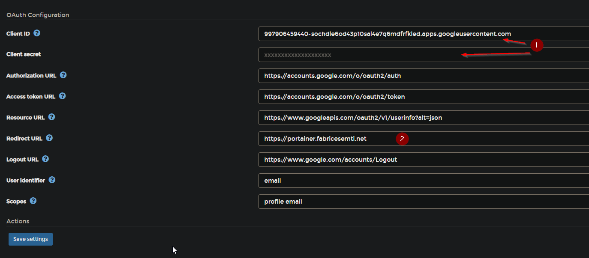

# Notes

For the notes regarding the template, please visit: <https://github.com/k8s-at-home/template-cluster-k3s>

## Useful links

[markdown table generator](https://www.tablesgenerator.com/markdown_tables#)

[kubecolor](https://github.com/hidetatz/kubecolor)

[k8s-at-home helm reference](https://github.com/k8s-at-home/library-charts/blob/main/charts/stable/common/values.yaml)

[material icons - for Hajimari](https://materialdesignicons.com/)

## Network topology

| node  | ip address   | role   |
|-------|--------------|--------|
| k8s-0 | 192.168.1.10 | master |
| k8s-1 | 192.168.1.11 | master |
| k8s-2 | 192.168.1.12 | worker |
| k8s-3 | 192.168.1.13 | worker |

## Addons

[Kubectx](https://github.com/ahmetb/kubectx)
[k9s](https://k9scli.io/)

## Deployment

1. First we follow the steps detailed in <https://github.com/k8s-at-home/template-cluster-k3s>

2. Next, as we have a few additional secrets and settings, we need to update the following files:

    - cluster/base/cluster-secrets.sops.yaml
    - cluster/base/cluster-settings.yaml

3. Most secrets come from these files, and thanks to the [reflector](https://github.com/emberstack/kubernetes-reflector) are mirrored to the relevant namespaces.
However currently - March 2022 - there are a a few apps that require their own separate secrets:

- [vpn-gateway](https://github.com/k8s-at-home/pod-gateway) - `cluster/core/vpn-gateway`
- [flux notifications](https://fluxcd.io/docs/guides/notifications/) - `cluster/base/flux-system/notifications`

    The secrets within these folders need to be manually re-created and re-encrypted (with [sops](https://github.com/mozilla/sops))

## Portainer oauth2

Portainer integrates with (Google) oauth2, therefore you can add this within the ap, does not need to have the Traefik oauth frontend.

To do this, when the app is deployed, log in (cretate admin account for basic auth) and enable settings > oauth.

Then set up oauth (you will need to have a prject in Google Cloud platform, which is outside the scope of this guide)

## Inspiration / credits

<https://github.com/spacesyl/klus>
